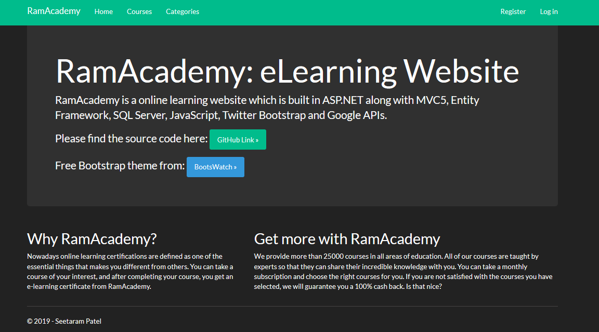
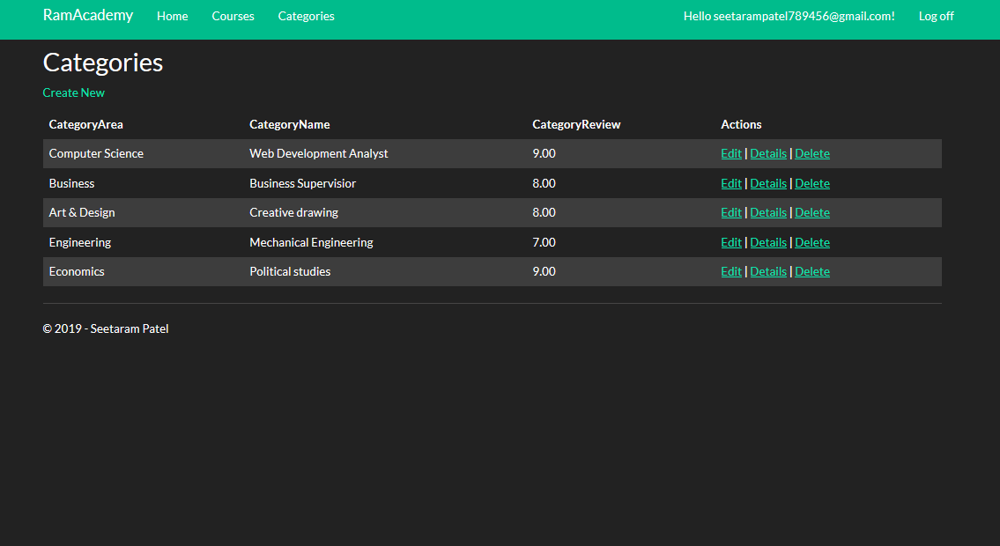
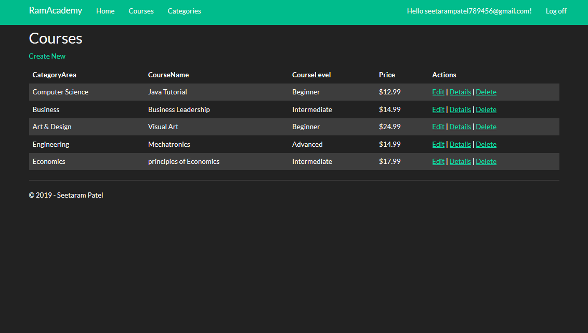

<h1>RamAcademy: eLearning Website</h1>

RamAcademy is a online learning website which is built in ASP.NET along with MVC5, Entity Framework, SQL Server, JavaScript, Twitter Bootstrap and Google APIs.
	

Online Learning Website also support google API so that users can log in with their google accounts.

100 % unit testing on CoursesController and CategoriesController with the coverage of Index, Create: GET, Create: POST, Edit: GET, Edit: POST, Delete and Delete Confirmed.

Bootstrap Darkly theme from: <a href="https://bootswatch.com/3/">https://bootswatch.com/3/</a>

Azure Link - <a href = "https://onlinelearningwebsite.azurewebsites.net/">https://onlinelearningwebsite.azurewebsites.net/</a>

This is a template of online learning website, which I created with ASP.NET

<h2>Main Page</h2>	

<h2>Log In Page</h2>	

<h2>Categories Page</h2>	

<h2>Courses Page</h2>	
 